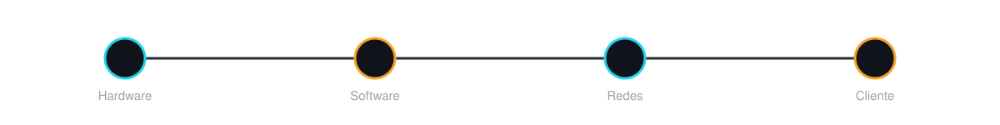

  

  

  
  

  Desarrollador especializado en Inteligencia Artificial: diseño agentes, 
  automatizaciones y software con IA de principio a fin. También soy técnico 
  IT — reparo hardware y monto redes y servidores — y he colaborado con
  <a href="https://github.com/sistemasmanyaro-dev">ManYaro Tech</a> en
  automatización con IA para negocios locales.

  

  

 

INTELIGENCIA ARTIFICIAL

<table align="center">
<tr>
<td width="33%" valign="top">

 **Desarrollador de IA**

Diseño e integro soluciones de inteligencia artificial a medida de cada proyecto.

</td>
<td width="33%" valign="top">

 **Aplicaciones con IA**

Desarrollo aplicaciones que incorporan IA de principio a fin, no como un añadido.

</td>
<td width="33%" valign="top">

 **Software con IA**

Construyo software a medida que usa IA para resolver problemas reales de negocio.

</td>
</tr>
<tr>
<td width="33%" valign="top">

 **Automatizaciones**

Automatizo tareas y flujos de trabajo repetitivos para ahorrar tiempo y reducir errores.

</td>
<td width="33%" valign="top">

 **Agentes de IA**

Diseño y despliego agentes autónomos que ejecutan tareas concretas de principio a fin.

</td>
<td width="33%" valign="top">

 **Procesos con IA**

Rediseño procesos de negocio completos apoyándolos en inteligencia artificial.

</td>
</tr>
</table>

 

HARDWARE — MANTENIMIENTO Y REPARACIÓN

<table align="center">
<tr>
<td width="25%" valign="top">

 **Móviles**

Diagnóstico y reparación de smartphones: pantallas, baterías, conectores y software.

</td>
<td width="25%" valign="top">

 **Portátiles**

Mantenimiento, limpieza, cambio de componentes y puesta a punto de portátiles.

</td>
<td width="25%" valign="top">

 **Consolas**

Reparación y mantenimiento de consolas de sobremesa y portátiles.

</td>
<td width="25%" valign="top">

 **Torres / sobremesa**

Montaje, ampliación, limpieza y diagnóstico de ordenadores de torre.

</td>
</tr>
</table>

 

PROGRAMACIÓN

  
  
  
  
  

SERVIDORES Y REDES

  
  
  
  
  
  
  
  

 

HERRAMIENTAS CON LAS QUE HE TRABAJADO

  
  
  
  

Frontend

  
  
  

Backend

  
  
  
  

IA y herramientas

  
  
  
  
  
  
  
  
  
  
  
  
  
  

Mark2Eli — Colaborador en <a href="https://github.com/sistemasmanyaro-dev">ManYaro Tech</a>

